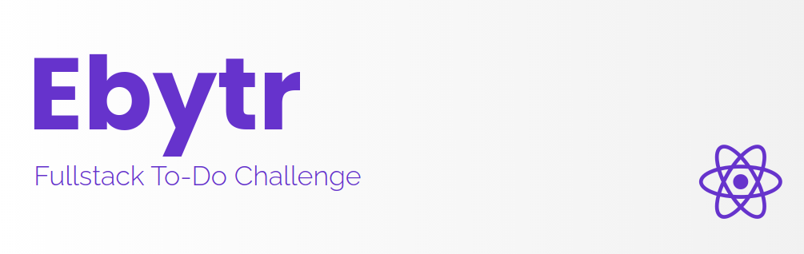
<br />

# :pushpin: Index
- [Media](#camera_flash-media)
- [About](#monocle_face-about)
- [Technologies](#rocket-technologies)
- [Installation Steps](#hammer_and_wrench-installations-steps)
- [Author](#closed_book-author)
<br />

---

# :camera_flash: Media

Login
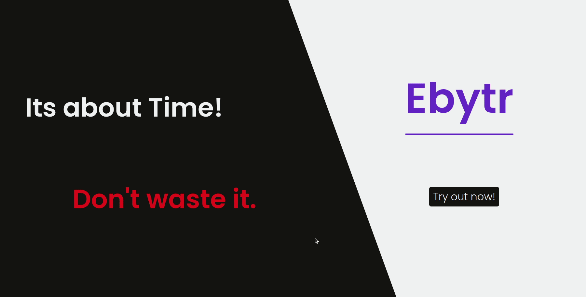

Delete Task
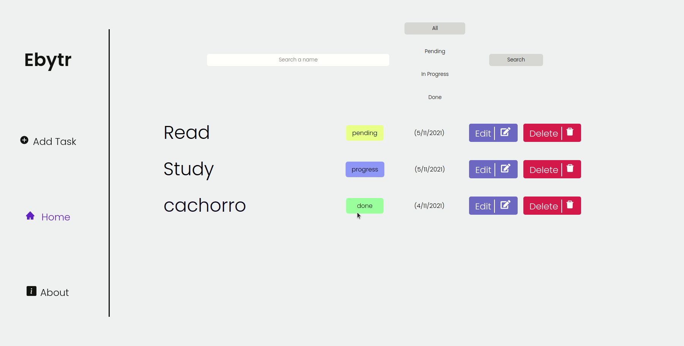

Add and Edit Task
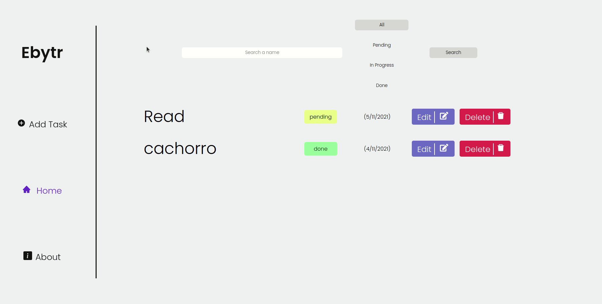

Filters
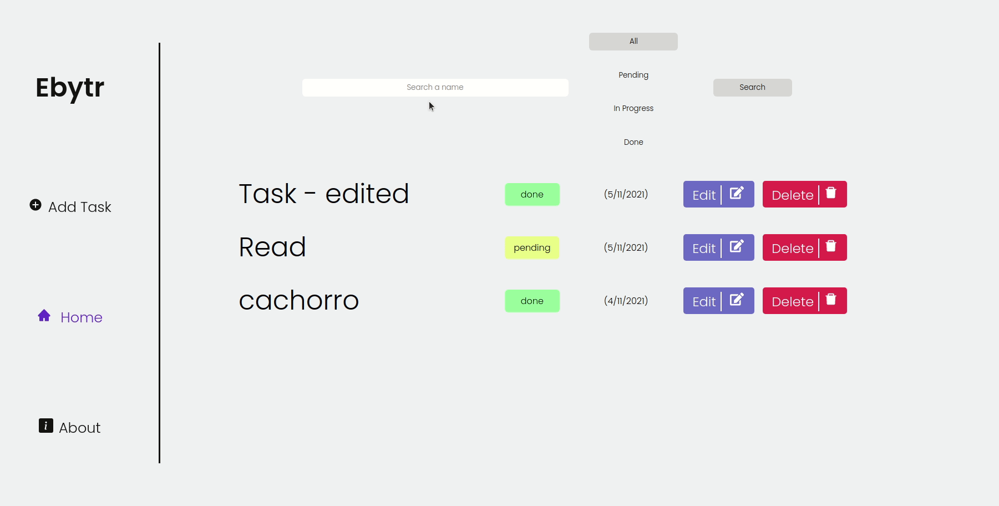


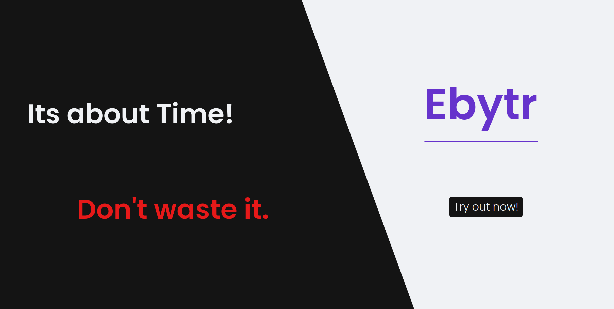

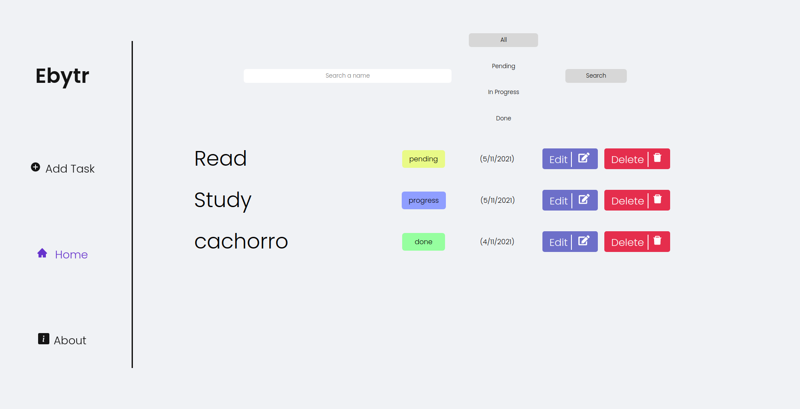

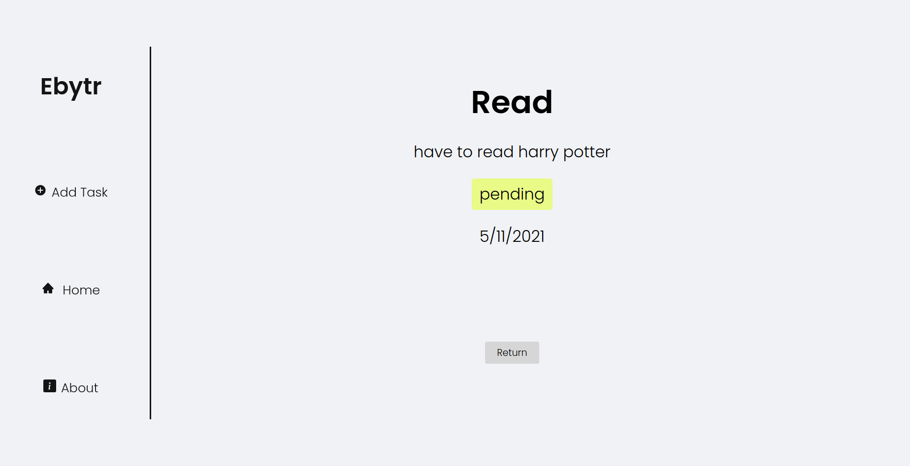

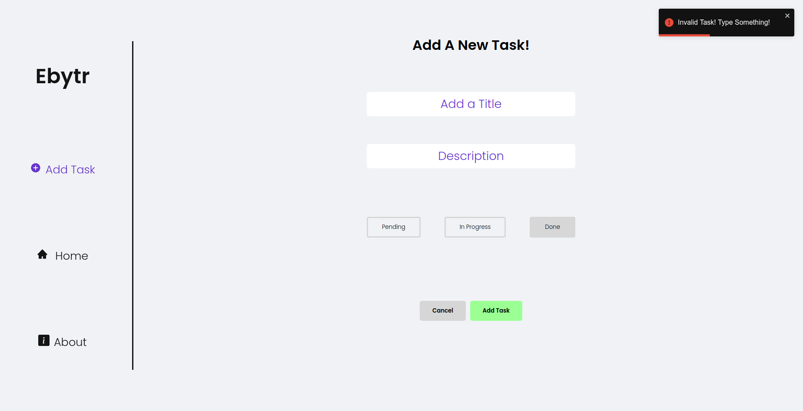

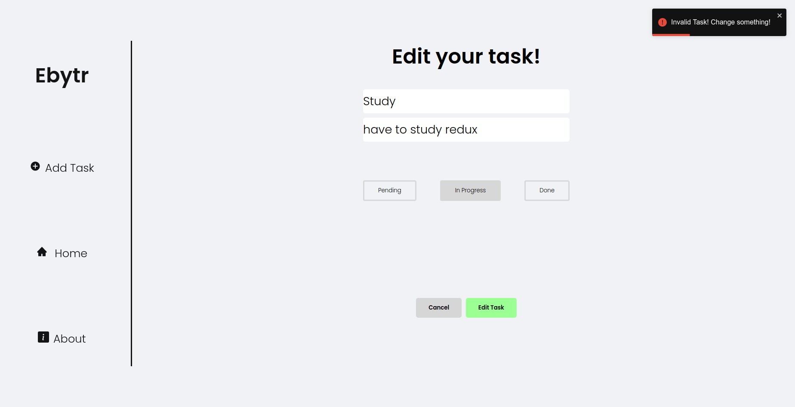

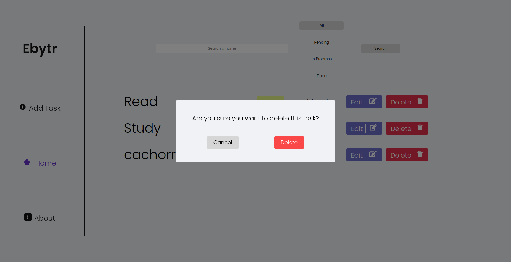

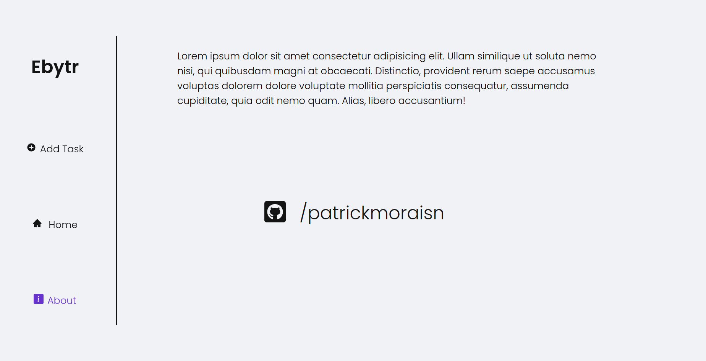


<br />

---
# :monocle_face: About
This challenge was made by integrating React with MongoDB using Mongoose.

The aim is to make a full-stack application with the basic features of a CRUD.
<br />

---

# :rocket: Technologies
Esse projeto foi feito utilizando as seguintes tecnologias: <br>
- :heavy_check_mark: **React**
- :heavy_check_mark: **Node**
- :heavy_check_mark: **Express**
- :heavy_check_mark: **TypeScript**
- :heavy_check_mark: **MongoDB**
- :heavy_check_mark: **Mongoose**
- :heavy_check_mark: **Styled Components**
- :heavy_check_mark: **ESLint**
- :heavy_check_mark: **Prettier**
- :heavy_check_mark: **React Toastify / React-Modal**
- :heavy_check_mark: **Jest / RTL**
<br><br>
<br />

---

# :hammer_and_wrench: Installation Steps
**This project involves environment variables, make sure you have them before trying to run!**

1. Clone the repository

```bash
git clone git@github.com:PatrickMoraisN/Ebytr-Challenge.git
```

2. Change to repository directory

```bash
cd Ebytr-Challenge
```

3. Open a terminal and change to the 'backend' directory

```bash
cd backend
```

4. Create an `.env` file at the root of 'backend' directory and add environment variables

```bash
## MongoDB

***Must have MongoDB installed***

MONGO_URL=mongodb://localhost:27017/ebytr
PORT=3232
```

5. Install the dependencies

```bash
npm install
```

6. Start backend server and let it run

```bash
npm start
```

7. Open a new terminal tab and change to the 'frontend' directory

```bash
cd frontend
```

8. Install the dependencies

```bash
npm install
```

9. Start frontend server

```bash
npm start
```

You are all set! Open localhost:3000 to see the app.

---

# :closed_book: Author
Patrick Morais <br>
[](https://www.linkedin.com/in/patrick-morais/)<br>
[](mailto:ppternunes@gmail.com)<br>
[](https://www.github.com/patrickmoraisn/)
